```python
import numpy as np
import math
import matplotlib.pyplot as plt
%matplotlib inline  
from scipy.special import expit
```


```python
## Unit Paramenters
# act = activation sent to other units
# act_nd = non-depressed activation -- prior to application of any short-term plasticity
# net_raw = raw netinput, prior to time-averaging
# net = time-averaged excitatory conductance (net input)
# gc_i = inhibitory conductance, computed from FFFB inhibition function typically
# I_net = net current, combining excitatory, inhibitory, and leak channels
# v_m = membrane potential
# v_m_eq = equilibrium membrane potential -- not reset by spikes -- just keeps integrating
# adapt = adaptation current
# avg_ss = super-short term running average activation
# avg_s = short-term running average activation, integrates over avg_ss, represents plus phase learning signal
# avg_m = medium-term running average activation, integrates over avg_s, represents minus phase learning signal
# avg_l = long-term running average activation, integrates over avg_m, drives long-term floating average for Hebbian learning
# avg_l_lrn = how much to use the avg_l-based Hebbian learning for this receiving unit's learning -- in addition to the basic error-driven learning -- this is dynamically updated based on the avg_l factor, so that this Hebbian learning constraint can be stronger as a unit gets too active and needs to be regulated more strongly.
# avg_s_eff = effective avg_s value used in learning -- includes a small fraction (.1) of the avg_m value, for reasons explained below.

## Synapse Parameters
#wt = net effective synaptic weight between objects -- subject to contrast enhancement compared to fwt and swt
#dwt = delta-wt -- change in synaptic weights due to learning
#fwt = fast weight -- used for advanced fast and slow weight learning dynamic -- otherwise equal to swt -- stored as non-contrast enhanced value
#swt = slow weight -- standard learning rate weight -- stored as non-contrast enhanced value
```


```python
n = 1 # number of inputs
num_cycles = 100 # number of cycles (ms) per trial
noise = 0

# Constants
dt_integ = 1 # global integration time constant, (1 = 1 msec default)
dt_net_dt = 1/1.4 # time integration of net input, using net_dt (1/1.4 default)

# net current = sum of individual ionic channels: e = excitatory, l = leak 
# (gc_l is a constant, 0.1 default), and i = inhibitory
gc_l = 0.1 # leak current
# e_rev are reversal potentials: in normalized values derived from biophysical 
# values, e_rev.e = 1, .l = 0.3, i = 0.25
e_rev_e = 1
e_rev_l = 0.3
e_rev_i = 0.25
dt_vm_dt = 1/3.3 # voltage of membrane change constant
thr = 0.5 # threshold membrane potential for firing
# adapt.dt = 1/144, vm_gain = 0.04, spike_gain = .00805 defaults
adapt_dt = 1/144
vm_gain = 0.04
spike_gain = .00805
# spk_thr is spiking threshold (1.2 default, different from rate code thr), vm_r = .3
spk_thr = 1.2
vm_r = .3
exp_slope = .02
g_bar_l = .3
# running average constants
sdc = 5 # constant manipulation on spike info to get rate code
ss_dt = .5/sdc
s_dt = .5/sdc
m_dt = .1/sdc
avg_l_max = 1.5
avg_l_min = .2
l_dt = .1/sdc
# constant to mix medium term factor into short term factor, 
# so that plus phase activation shuts neuron off
m_in_s = .1 
avg_l_lrn_min = 0.005
avg_l_lrn_max = 0.05
lrate = .1
# m_lrn is a constant and is typically 1.0 when error-driven learning is employed 
# (but can be set to 0 to have a completely Hebbian model).
m_lrn = 1
m_lrn = 0 # turns off short time constant learning
```


```python
net_raw = 0 # initialize raw net input
net = 0 # the net input at any given time
v_m = 0.3
adapt = 0
#https://lintu.ucsd.edu/ipynb/tsainbur/notebooks/LeabraTests/Learning.ipynb#average activations
avg_ss = 0
avg_s = 0
avg_m = 0
avg_l = 0
I_net = 0
dwt = 0 # weight change parameter
fwt = .5
wt = 0.5 # the weight of neuron 1 on neuron 2

# initialize variables that will be saved
net_saved = []
net_raw_saved = []
v_m_saved = []
adapt_saved = []
act_saved = []
I_net_saved = []
avg_ss_saved = []
avg_s_saved = []
avg_m_saved = []
avg_l_saved = []
act_nd_saved= []
avg_l_lrn_saved = []
avg_s_eff_saved = []
dwt_saved = []
srs_saved = []
srm_saved = []
fwt_saved = []
wt_saved = []
XCAL_saved = []

```


```python
# XCAL function (check mark) - decides if learning is positive, or negative
d_thr = 0.0001 # threshold for learning
d_rev = .1 # reversal point constant
def XCAL( x, th ):
    out = -x * ((1-d_rev)/d_rev)
    if not isinstance(x, float):
        out[x < d_thr] = 0
        out[x > th * d_rev] = x[x > th * d_rev] - th[x > th * d_rev]
    else:
        if (x < d_thr):
            out = 0
        elif x > th * d_rev:
            out = x - th
    return out
```


```python
srs_ex = np.arange(0,1,0.0001) # Sender reciever co-product (short term)
srm_ex = np.repeat(.5, 10000) # sender reciever co-product, long term
x = XCAL(srs_ex, srm_ex)
```

# Visual of XCAL Function


```python
print(x)
print((srs_ex))
plt.plot(srs_ex,x)
plt.show()
```

    [ 0.     -0.0009 -0.0018 ...,  0.4997  0.4998  0.4999]
    [  0.00000000e+00   1.00000000e-04   2.00000000e-04 ...,   9.99700000e-01
       9.99800000e-01   9.99900000e-01]


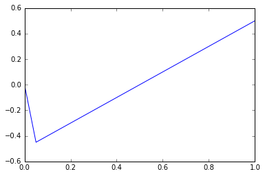


## Visual of Squashing Function


```python
gain = 1.5
off = 1

def SIG_reg(x):
    return 1/(1+(np.e**-x))

def SIG(x):
    return 1/ (1+((1 - x)/(x+.01))**gain)

x = np.arange(-3,3,.01)
#print(1 / (1 + (x / (off*(1-x)  ) )^-gain))
y = (SIG_reg(x))
z = (SIG(x))
plt.plot(x,y)
plt.plot(x,z, 'r')
plt.show()
```

    /usr/local/home/tsainbur/.conda/envs/tsainbur/lib/python2.7/site-packages/ipykernel/__main__.py:8: RuntimeWarning: invalid value encountered in power


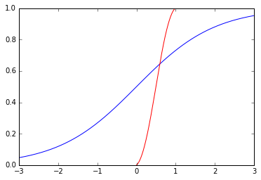


```python

```


```python
neuron_input = [0,0,1,1,1,1,0,0,0,.2,.2,.2,0,0,.5,.5,0,0,.3,0] # create a list of inputs
su_avg_s_eff_full = [0,0,1,1,1,1,0,0,0,.2,.2,.2,0,0,.5,.5,0,0,.3,0]
su_avg_m_full = [0,0,1,1,1,1,0,0,0,.2,.2,.2,0,0,.5,.5,0,0,.3,0]

for trial in xrange(len(neuron_input)): # for each trial
    for cycle in xrange(num_cycles):
        
        ## Input
        current_cycle = trial*num_cycles + cycle # current cycle in this trial
        # net_raw += (sum over recv connections of:) scale_eff * act * wt
        net_raw = 1/n * neuron_input[trial]*wt
        # net += dt.integ * dt.net_dt * (net_raw - net)
        net = net + dt_integ * dt_net_dt * (net_raw - net)

        ## Inhibition
        # we'll worry about this in a minute...
        gc_i = 0 # PLACEHOLDER for inhibition
        
        ## Membrane Potential
        #I_net = net * (e_rev.e - v_m) + gc_l * (e_rev.l - v_m) + gc_i * (e_rev.i - v_m) + noise
        # net current = sum of individual ionic channels: e = excitatory, 
        # l = leak (gc_l is a constant, 0.1 default), and i = inhibitory
        I_net = net * (e_rev_e - v_m) + gc_l * (e_rev_l - v_m) + gc_i * (e_rev_e - v_m) + noise
        
        # I_net += g_bar.l * exp_slope * exp((v_m - thr) / exp_slope)
        # this is the exponential component of AdEx, if in use (typically only for discrete 
        # spiking), exp_slope = .02 default
        I_net = I_net + g_bar_l * exp_slope * np.exp((v_m - thr) /exp_slope)
        
        # v_m += dt.integ * dt.vm_dt * (I_net - adapt)
        # in emergent, we use a simple midpoint method that evaluates v_m with a half-step 
        # time constant, and then uses this half-step v_m to compute full step in above I_net equation. 
        v_m = v_m + dt_integ * dt_vm_dt * (I_net - adapt)
        
        #if(v_m > spk_thr) { spike = 1; v_m = vm_r } else { spike = 0 }
        if(v_m > spk_thr):
            spike = 1
            v_m = vm_r 
        else: 
            spike = 0        
        
        act = spike
        
        # adapt += dt.integ * (adapt.dt * (vm_gain * (v_m - e_rev.l) - adapt) + spike * spike_gain)
        # adaptation current -- causes rate of activation / spiking to decrease over time, 
        # adapt.dt = 1/144, vm_gain = 0.04, spike_gain = .00805 defaults
        #adapt = adapt + (adapt_dt*(vm_gain * (v_m - e_rev_l)) + spike * spike_gain)
        adapt = adapt + ((vm_gain * (v_m - e_rev_l)) + spike * spike_gain)/144
        #print((vm_gain * (v_m - e_rev_l)) + spike * spike_gain)
        
        ## Learning
        # Running averages computed continuously every cycle, and note the compounding 
        # form (see LeabraUnitSpec.cpp for code)
        
        act_nd = act # switch from rate code to spiking

        mult_coeff = 1 # this is to make act avg seem bigger due to spiking 
        # avg_ss += dt.integ * ss_dt * (act_nd - avg_ss)
        # super-short time scale running average, ss_dt = 1/2 default -- this was introduced to 
        # smooth out discrete spiking signal, but is also useful for rate code
        avg_ss = avg_ss + dt_integ * ss_dt * (act_nd  - avg_ss)
        
        
        # avg_s += dt.integ * act_avg.s_dt * (avg_ss - avg_s)
        # short time scale running average, s_dt = 1/2 default -- this represents the 
        # "plus phase" or actual outcome signal in comparison to avg_m
        avg_s = avg_s + dt_integ * s_dt * (avg_ss - avg_s)
        
        # avg_m += dt.integ * act_avg.m_dt * (avg_s - avg_m)
        # medium time-scale running average, m_dt = 1/10 average -- this represents 
        # the "minus phase" or expectation signal in comparison to avg_s
        avg_m = avg_m + dt_integ * m_dt * (avg_s - avg_m)
        
        # avg_l += (avg_m > 0.2) ? dt * (avg_l.max - avg_m) : dt * (avg_l.min - avg_m)
        # long-term running average -- this is computed just once per learning trial, 
        # not every cycle like the ones above -- max = 1.5, min = .1, dt = .1 by default
        #if (avg_m > .2):
        if cycle == 0: # do this once per trial
            avg_l = avg_l + l_dt * (avg_m  - avg_l)
        #else:
            #avg_l = avg_l + l_dt * (avg_l_min - avg_m)
        
        # avg_l_lrn = avg_l.lrn_min + (avg_l - avg_l.min) * ((avg_l.lrn_max - avg_l.lrn_min) / avg_l.max - avg_l.min))
        avg_l_lrn = avg_l_lrn_min + (avg_l - avg_l_min) * ((avg_l_lrn_max - avg_l_lrn_min)/avg_l_max - avg_l_min)
        # learning strength factor for how much to learn based on avg_l floating threshold -- 
        # this is dynamically modulated by strength of avg_l itself, and this turns out to be critical -- 
        # the amount of this learning increases as units are more consistently active all the time (i.e., 
        # "hog" units). avg_l.lrn_min = 0.005, avg_l.lrn_max = 0.05.
        
        # avg_s_eff = m_in_s * avg_m + (1 - m_in_s) * avg_s
        # mix in some of the medium-term factor into the short-term factor -- this is important 
        # for ensuring that when neuron turns off in the plus phase (short term), that enough 
        # trace of earlier minus-phase activation remains to drive it into the LTD weight 
        # decrease region -- m_in_s = .1 default.
        avg_s_eff = m_in_s * avg_m + (1-m_in_s) * avg_s
        
        ## Learning Equations
        
        # srs = ru->avg_s_eff * su->avg_s_eff
        # short-term sender-receiver co-product -- this is the intracellular calcium from 
        # NMDA and other channels
        su_avg_s_eff = su_avg_s_eff_full[trial]
        srs = avg_s_eff * su_avg_s_eff
        
        # srm = ru->avg_m * su->avg_m
        # medium-term sender-receiver co-product -- this drives dynamic threshold for error-driven learning
        su_avg_m = su_avg_m_full[trial]
        srm = avg_m * su_avg_m
        
        # dwt += lrate * [ m_lrn * XCAL(srs, srm) + ru->avg_l_lrn * XCAL(srs, ru->avg_l)]
        # weight change is sum of two factors: error-driven based on medium-term threshold (srm),
        # and BCM Hebbian based on long-term threshold of the recv unit (ru->avg_l)
        # in earlier versions, the two factors were combined into a single threshold value, 
        # using normalized weighting factors -- this was more elegant, but by separating the two apart, 
        # we allow the hebbian component to use the full range of the XCAL function (as compared to the
        # relatively small avg_l_lrn factor applied inside the threshold computation). By multiplying by 
        # avg_l_lrn outside the XCAL equation, we get the desired contrast enhancement property of the 
        # XCAL function, where values close to the threshold are pushed either higher (above threshold) or 
        # lower (below threshold) most strongly, and values further away are less strongly impacted.
        # m_lrn is a constant and is typically 1.0 when error-driven learning is employed (but can be 
        # set to 0 to have a completely Hebbian model).
        
        
        dwt = dwt + lrate * ( m_lrn * XCAL(srs, srm) + avg_l_lrn * XCAL(srs, avg_l))

        ## Weight update equation
        
        # dwt *= (dwt > 0) ? (1-fwt) : fwt
        # soft weight bounding -- weight increases exponentially decelerate toward upper bound of 1, and 
        # decreases toward lower bound of 0. based on linear, non-contrast enhanced fwt weights.
        if dwt > 0:
            dwt = dwt * (1-fwt)
        else:
            dwt = dwt * fwt
        # The fwt value here is the linear, non-contrast enhanced version of the weight value, while wt 
        # is the sigmoidal contrast-enhanced version, which is used for sending netinput to other neurons. 
        # One can compute fwt from wt and vice-versa, but numerical errors can accumulate in going back-and
        # forth more than necessary, and it is generally faster to just store these two weight values (and 
        # they are needed for the fast weights version show below).
        # fwt += dwt
        # increment the linear weights with the bounded dwt term
        fwt = fwt + dwt
        wt = SIG(fwt)
        # new weight value is sigmoidal contrast enhanced version of fast weight
        wt = SIG(fwt)

        
        ## save input variables
        net_saved.append(net)
        net_raw_saved.append(net_raw)
        v_m_saved.append(v_m)
        act_saved.append(act)
        adapt_saved.append(adapt)
        I_net_saved.append(I_net)
        act_nd_saved.append(act_nd)
        avg_ss_saved.append(avg_ss)
        avg_s_saved.append(avg_s)
        avg_m_saved.append(avg_m)
        avg_l_saved.append(avg_l)
        avg_l_lrn_saved.append(avg_l_lrn)
        avg_s_eff_saved.append(avg_s_eff)
        dwt_saved.append(dwt)
        srs_saved.append(srs)
        srm_saved.append(srm)
        fwt_saved.append(fwt)
        wt_saved.append(wt)
        XCAL_saved.append(XCAL(srs, avg_l))

        
        dwt = 0


```


```python
width = 17
height = 3
plt.figure(figsize=(width, height))
plt.plot(net_saved, 'r')
plt.plot(net_raw_saved, 'b')
plt.title('Net Input')
axes = plt.gca()
axes.set_ylim([0,1.5])
#axes.set_xlim([0,100])
plt.show()
```


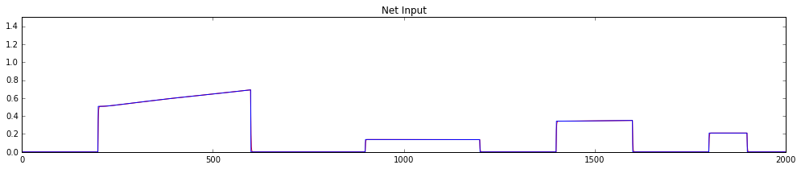


```python
width = 17
height = 3
plt.figure(figsize=(width, height))
plt.plot(v_m_saved,'b')
#plt.plot(I_net_saved, 'r:')
plt.title('Membrane Voltage')

axes = plt.gca()
#axes.set_ylim([0,1])
#axes.set_xlim([100,300])
plt.show()
```


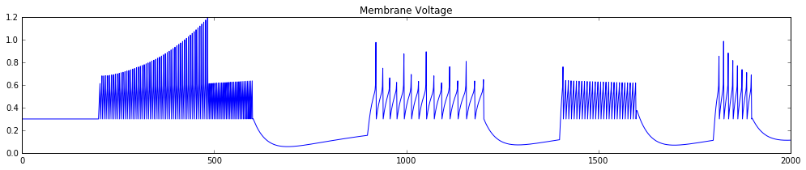


```python
width = 17
height = 3
plt.figure(figsize=(width, height))
plt.plot(adapt_saved)
plt.title('Adapt Factor')
plt.show
#print(adapt_saved)
```


    <function matplotlib.pyplot.show>


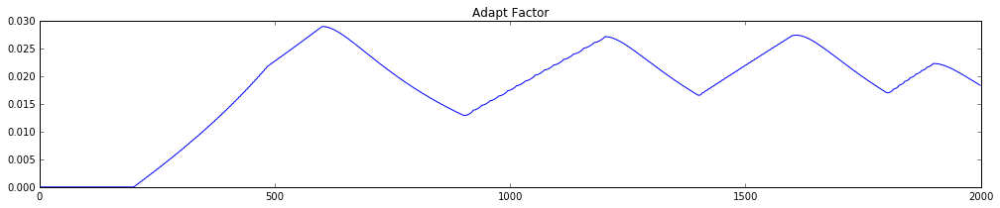


## Recieving Cell activation 


```python
width = 17
height = 3
plt.figure(figsize=(width, height))
plt.plot(act_saved)
plt.plot(act_nd_saved)
plt.show
```


    <function matplotlib.pyplot.show>


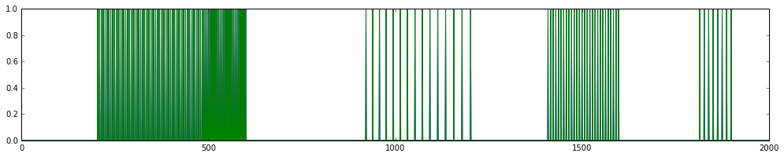


## Running Activations


```python
width = 17
height = 3
plt.figure(figsize=(width, height))
plt.plot(avg_ss_saved, 'b')
plt.plot(avg_s_saved, 'g')
plt.plot(avg_m_saved, 'r')
plt.plot(avg_l_saved, 'black')
axes = plt.gca()
#axes.set_ylim([0,1])
#axes.set_xlim([100,300])
plt.show
```


    <function matplotlib.pyplot.show>


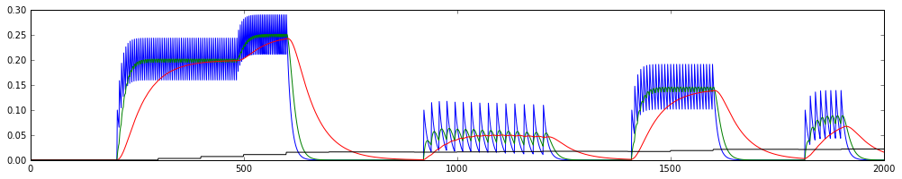


## Synaptic strength over time


```python
width = 17
height = 3
plt.figure(figsize=(width, height))
plt.plot(dwt_saved, 'b')
plt.plot(wt_saved, 'g')
plt.plot(fwt_saved, 'r')


plt.show
```


    <function matplotlib.pyplot.show>


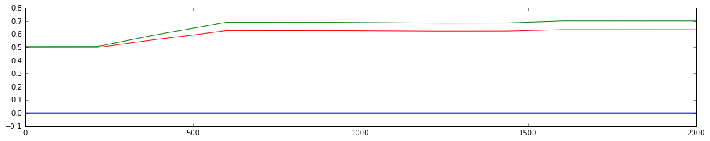


## Short and medium term sender reciever co-product
#### SRS = short term co-product ~= intracellular calcium from NMDA, other channels
#### SRM = medium term co-product ~- drives dynamic threshold for error driven learning


```python
width = 17
height = 3
plt.figure(figsize=(width, height))
plt.plot(srm_saved)
plt.plot(srs_saved)
plt.show()
```


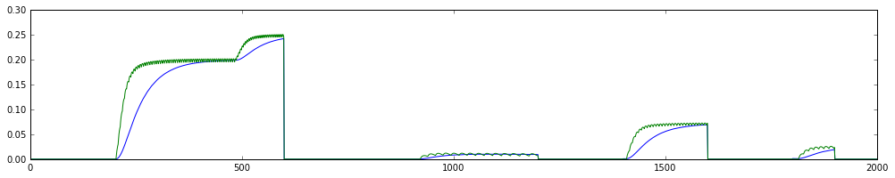


```python
width = 17
height = 3
plt.figure(figsize=(width, height))
plt.plot(avg_l_saved, 'b')
plt.plot(srs_saved, 'r')
plt.plot(XCAL_saved, 'g')
plt.hlines([0],[0], len(srs_saved), lw=2)
plt.show()
```


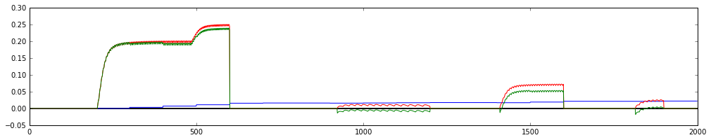


## DWT = weight change from sending to recieving neuron


```python
width = 17
height = 4
plt.figure(figsize=(width, height))
plt.plot(dwt_saved)
plt.hlines([0],[0], len(srs_saved), lw=2)
plt.show()
```


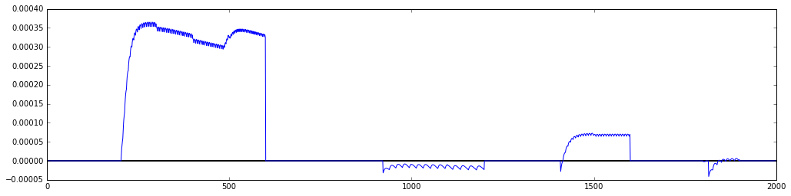


```python

```
